# Configuração do ambiente para executar o sdk
## iOS
### Instalando as ferramentas
Acesse a documentação do [React Native](https://reactnative.dev/docs/environment-setup) clique no menu React Native CLI Quickstart, depois escolha o SO de Desenvolvimento e na opção Target OS escolha **iOs**.

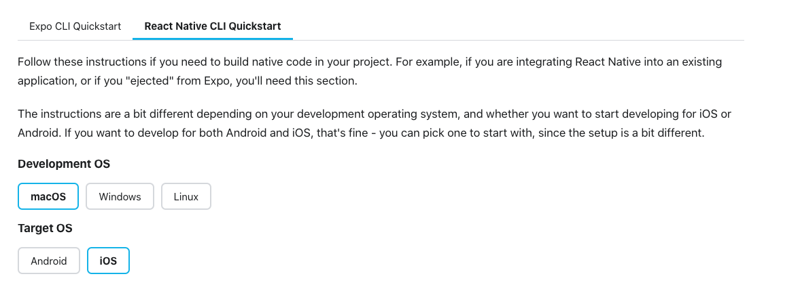

Siga os passos da documentação para instar o React Native e o configuarar o Xcode. 

### Configurando o NPM

Adicione na Raiz seu usuário (~/) um arquivo .npmrc, caso já exista apenas adicione o conteudo a seguir ao final do arquivo:
``` linenums="1"
; begin auth token
//pkgs.dev.azure.com/vstscs/Produtos-Agile/_packaging/teste2/npm/registry/:username=vstscs
//pkgs.dev.azure.com/vstscs/Produtos-Agile/_packaging/teste2/npm/registry/:_password=[BASE64_ENCODED_PERSONAL_ACCESS_TOKEN]
//pkgs.dev.azure.com/vstscs/Produtos-Agile/_packaging/teste2/npm/registry/:email=npm requires email to be set but doesn't use the value
//pkgs.dev.azure.com/vstscs/Produtos-Agile/_packaging/teste2/npm/:username=vstscs
//pkgs.dev.azure.com/vstscs/Produtos-Agile/_packaging/teste2/npm/:_password=[BASE64_ENCODED_PERSONAL_ACCESS_TOKEN]
//pkgs.dev.azure.com/vstscs/Produtos-Agile/_packaging/teste2/npm/:email=npm requires email to be set but doesn't use the value
; end auth token
```

Para criar seu PERSONAL_ACCESS_TOKEN [Aceesso o Portal do VSTSCS ](https://dev.azure.com/vstscs/_details/security/tokens) com apenas as seguintes permissões Packaging read & write scopes.

Com o token gerado é nessário codificar ele me BASE-64, a forma de fazer isso sem gerar problemas na autenticação é a seguinte: 
 * Primeiro  execute o seguinte comando no seu terminal
 ``` bash
 $:> node -e "require('readline') .createInterface({input:process.stdin,output:process.stdout,historySize:0}) .question('PAT> ',p => { b64=Buffer.from(p.trim()).toString('base64');console.log(b64);process.exit(); })"
 ```
 * Irá aparecer um prompt nele digite o PERSONAL_ACCESS_TOKEN
 * Copie o resulta que será exibido no seu terminal e substitua [BASE64_ENCODED_PERSONAL_ACCESS_TOKEN] no seu ~/.npmrc.

### Configurando o projeto

Abra um terminal tty na raiz do projeto e em seguida execute o seguinte comando
```
$:> npm install
```

### Executando o projeto
Para executar o projeto ou apenas verificar se as configuração deram certo execute em um terminal tty:
```bash
$:> npx react-native start
```
Sem fechar o terminal com o comando anterior execute em um outro

```bash
$:> npx react-native run-ios
```

### Gerando o Arquivo .ipx para QA
Abra a pasta `ios` que se encontra na raiz do projeto no Xcode

* Clique no menu schemas que se encontro na parte superior direita do Xcode
    * 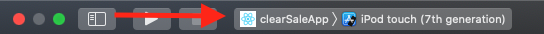

* Clique no menu novo esquema
   * 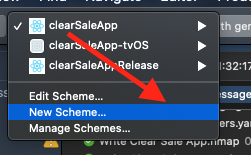

* Edite o nome do esquema e em seguida clique no botão **OK**
   * 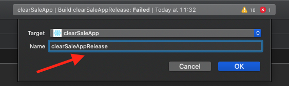

* Clique no menu schemas que se encontro na parte superior direita do Xcode
    * 

* Clique no menu Edite Esquema
   * 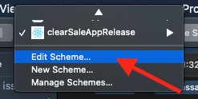

* Nos Menus **RUN**, **TESTE**, **PROFILE**, **ANALYSE**  e **ARCHIVE** clica na opção **BUILD CONFIGURATION** e escolha release ao final aperte o botão **Close**.
   * 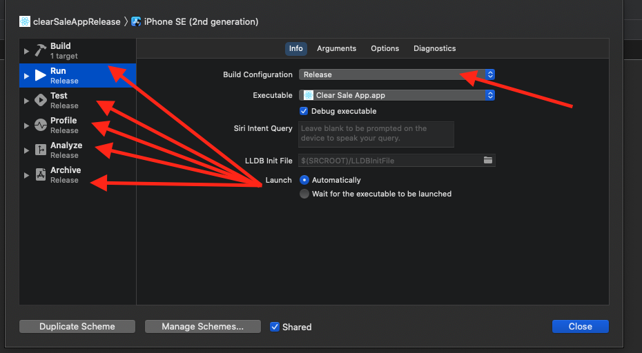

* Clique no menu dispositivos no canto superior direito e escolha o **IPHONE**.
   * OBS Escolher o aparelho ***iPhone*** e não o emulador. 
   * 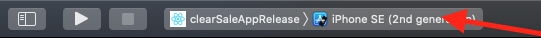

* Execute o projeto clicando no botão run no canto superior direito
   * 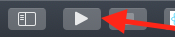

* Aguarde a execução concluir

* Após a build ser concluida, clique no botão *Project Navigation*
   * 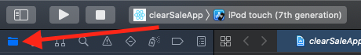

* Abra a pasta Products do clearSaleApp
   * 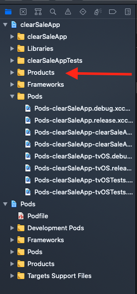

* Clique com o botão direito em cima do arquivo Clear Sale App.app
   * 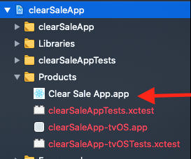

* Clique no menu *Mostrar no Finder*
   * 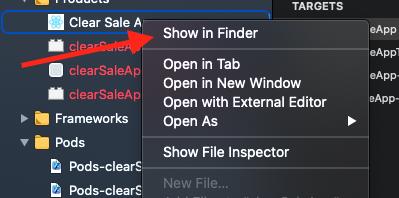

* No finder, clique com o botão direito no espaço vazio entre os arquivos e depois clique na opção criar nova Pasta, renomeie a pasta com o nome `Payload`. 
   * 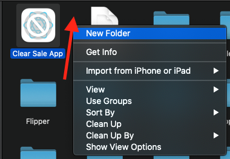

* Copie o Arquivo `Clear Sale App.app` para dentro da pasta Payload

* Abra um terminal dentro da pasta raiz onde estão os Arquivos `Clear Sale App.app` e `Payload`

* Execute o seguinte comando para gerar o arquivo `.ipx`:
    ```bash
    $:> zip -0 -y -r app-teste.ipa Payload/
    ```

* Consulte o QA para saber por onde vc deve enviar esse arquivo
